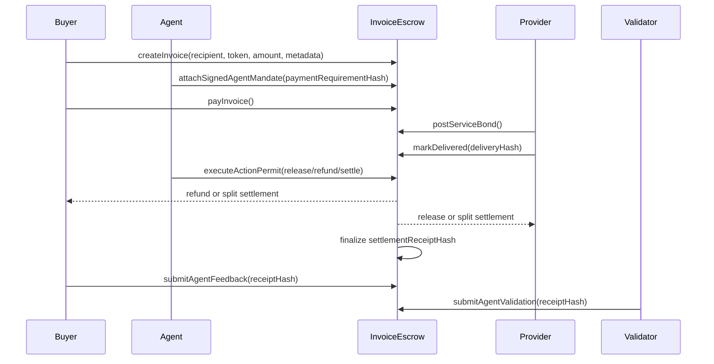
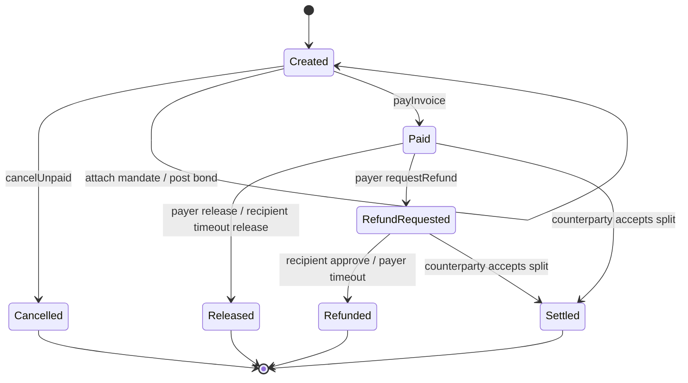

# Architecture

## Overview

MantleFlow is a two-part application:

- `InvoiceEscrow`: a Solidity escrow state machine deployed on Mantle Sepolia.
- `app`: a Next.js wallet UI that reads contract state, executes wallet-confirmed actions, and renders deterministic agent recommendations.

## One-Glance Sequence



## Lifecycle State Diagram



## Contract State Machine

```text
Created
  | payInvoice
  v
Paid
  | release by payer
  | release by recipient after timeout
  v
Released

Paid
  | requestRefund by payer
  v
RefundRequested
  | refund by recipient
  | refund by payer after timeout
  v
Refunded

Paid or RefundRequested
  | proposeSettlement by payer or recipient
  | cancelSettlementProposal by proposer
  | acceptSettlement by counterparty
  v
Settled

Created
  | attachAP2AgentMandate by creator or recipient
  | attachAgentMandate legacy compact mandate path
  | attachSignedAgentMandate with payer EIP-712 signature
  v
AgentContext attached

Created, Paid, or RefundRequested
  | postServiceBond by recipient
  v
Provider bond locked

Paid or RefundRequested
  | executeActionPermit with signer EIP-712 approval
  v
Normal release, refund, evidence, or settlement action

Created
  | cancelUnpaid by creator or recipient
  v
Cancelled
```

## Invoice Fields

- `creator`: wallet that created the invoice.
- `payer`: wallet that funded the invoice.
- `recipient`: wallet that receives released funds.
- `token`: `address(0)` for ETH, ERC20 address for token invoices.
- `amount`: amount locked in escrow.
- `dueAt`: deadline for initial payment.
- `paidAt`: timestamp when escrow was funded.
- `timeout`: waiting period for recipient timeout release or payer timeout refund.
- `refundRequestedAt`: timestamp when refund flow opened.
- `settlementProposedAt`: timestamp when a compromise split was proposed.
- `deliveryMarkedAt`: timestamp when delivery evidence was attached.
- `deliveryEvidenceCount`: number of delivery evidence entries appended.
- `disputeMarkedAt`: timestamp when payer first attached dispute evidence.
- `disputeEvidenceCount`: number of dispute evidence entries appended.
- `deliveryEvidenceRoot`: rolling hash root over all delivery evidence entries.
- `disputeEvidenceRoot`: rolling hash root over all dispute evidence entries.
- `state`: explicit invoice state.
- `metadataHash`: off-chain invoice metadata reference.
- `deliveryHash`: first off-chain delivery/evidence reference.
- `disputeHash`: first off-chain dispute/evidence reference.
- `settlementMemoHash`: off-chain settlement reasoning reference.
- `settlementProposedBy`: payer or recipient that proposed the split.
- `settlementRecipientAmount`: amount paid to recipient if counterparty accepts settlement.

## Agent Context

Each invoice can carry a lightweight agent accountability layer:

- `payerAgentHash`: hash of payer agent identity reference, wallet policy, or ERC-8004-style agent pointer.
- `recipientAgentHash`: hash of service agent identity reference.
- `mandateHash`: hash of a signed user mandate or payment instruction.
- `policyHash`: hash of agent risk controls, release conditions, or tool policy.
- `intentMandateHash`: AP2-style proof of the user's high-level buying intent.
- `cartMandateHash`: AP2-style proof of concrete invoice/cart terms.
- `paymentMandateHash`: AP2-style proof of the payment authorization payload.
- `promptPlaybackHash`: hash of the agent prompt/playback trail or policy transcript.
- `slaDeadline`: service-level deadline used by the agent panel.
- `attachedBy`: account that attached the context.
- `authorizedPayer`: optional payer address recovered from an EIP-712 signed mandate.
- `mandateExpiresAt`: optional expiry for the signed payer mandate.

This keeps the contract independent from any one registry while creating a deterministic bridge to agent identity, reputation, and signed mandate systems.

Mandates are immutable after first attachment and must be attached before payment. The unsigned UI path uses `attachAP2AgentMandate` so live demos produce non-zero intent/cart/payment/prompt hashes. The signed payer path uses EIP-712 `PaymentMandate`; for backward compatibility it maps `paymentMandateHash` to `mandateHash` and `promptPlaybackHash` to `policyHash`. A non-zero SLA deadline must be in the future, which prevents a payer from adding stale rules after funds or provider bond are already at risk.

Signed mandates use an EIP-712 `PaymentMandate` over:

- invoice id
- authorized payer
- `paymentRequirementHash(invoiceId)`
- payer and recipient agent hashes
- mandate hash
- policy hash
- SLA deadline
- mandate expiry

The signature verifier supports normal EOA signatures and ERC-1271 contract-wallet validation. If an authorized payer is set, only that payer can fund the invoice and the mandate must still be unexpired.

## Scoped Action Permits

MantleFlow also supports EIP-712 `ActionPermit` signatures for post-payment workflow automation. A payer or recipient can sign one bounded action for an executor without handing over private keys or granting broad approval.

The signed payload includes:

- invoice id
- action enum
- signer
- executor
- exact action parameter hash
- `validAfter`
- `expiresAt`
- nonce

`executeActionPermit` checks executor binding, time window, replay nonce, and EOA or ERC-1271 signature validity. It then calls the same internal functions used by direct wallet actions, with authorization evaluated against the signer instead of the relayer.

Supported delegated actions are:

- release
- request refund
- refund
- mark delivered
- mark disputed
- propose split settlement
- cancel split proposal
- accept split settlement

This is the wallet-permission layer around the escrow. It mirrors the direction of scoped permissions and account-abstraction execution while staying deployable today on Mantle Sepolia.

## Payment Requirement

`paymentRequirementHash(invoiceId)` is an x402-style escrow quote hash over:

- chain id and escrow contract
- invoice id
- recipient
- token
- amount
- due date
- timeout
- metadata hash

This gives HTTP/API agents and facilitators a compact requirement to compare before asking a wallet to sign or fund escrow. It is not a direct payment receipt; it is the pre-funding quote that the signed mandate binds to.

## x402 Facilitator Flow

MantleFlow exposes an HTTP payment interface for agents and facilitators:

```bash
curl -i https://YOUR_APP_URL/api/x402/0
```

If invoice `0` is still unpaid, the route returns HTTP `402 Payment Required` with an `accepts` array:

```json
{
  "x402Version": 1,
  "accepts": [
    {
      "scheme": "exact",
      "network": "mantle-sepolia",
      "asset": "0x...",
      "payTo": "0xEscrow",
      "maxAmountRequired": "50000000000000000",
      "resource": "https://YOUR_APP_URL/api/x402/0",
      "description": "Fund MantleFlow invoice #0",
      "extra": {
        "invoiceId": "0",
        "paymentRequirementHash": "0x...",
        "fundingMethod": "erc3009-receiveWithAuthorization",
        "escrowFunction": "payInvoiceWithAuthorization(uint256,address,uint256,uint256,bytes32,uint8,bytes32,bytes32)",
        "authorizationNonce": "0x...",
        "authorizationTo": "0xEscrow"
      }
    }
  ]
}
```

Facilitators can verify the on-chain requirement hash before funding:

```bash
curl -X POST https://YOUR_APP_URL/api/x402/verify \
  -H "content-type: application/json" \
  -d '{"invoiceId":"0","paymentRequirementHash":"0x..."}'
```

If the invoice is already paid or finalized, `GET /api/x402/:invoiceId` returns `200` with the current invoice state instead of a new payment requirement. This lets agents treat MantleFlow as an HTTP-native escrow resource while the contract remains the source of truth.

For ERC20 invoices whose token supports ERC-3009, the facilitator submits
`payInvoiceWithAuthorization(...)`. The contract requires the authorization nonce
to equal `paymentRequirementHash(invoiceId)`, calls
`receiveWithAuthorization(payer, address(this), amount, validAfter, validBefore,
nonce, v, r, s)`, checks the exact balance delta, and only then marks the
invoice paid. That makes the payer gasless while preventing a signed
authorization from being redirected to a different invoice.

The dashboard defaults to MNT on Mantle Sepolia, with ERC20 support available for compatible test tokens. USDC is
the intended stablecoin path for x402/EIP-3009 demos; CCTP is documented as the
production bridge for bringing native USDC onto Mantle before funding invoices.

## Agent APIs

- `/.well-known/agent.json`: A2A-style service discovery for x402, receipt, explain, simulate, and activity endpoints.
- `/api/mcp`: minimal MCP-over-HTTP JSON-RPC with `get_invoice`, `assess_invoice`, `x402_payment_requirement`, `get_receipt`, and `build_unsigned_call` tools.
- `/api/agent/explain`: deterministic invoice assessment with optional server-side OpenAI wording. The LLM can explain the policy but cannot decide authorization.
- `/api/agent/simulate`: deterministic allow/deny plus an `eth_call` dry-run for common invoice actions.
- `/api/receipt/:invoiceId`: structured receipt JSON mirroring the `settlementReceiptHash` preimage fields.

## Agent Reputation

Feedback and validation remain receipt-bound per invoice, and the contract also
maintains a cross-invoice aggregate keyed by `agentHash`:

- `getAgentReputation(agentHash)` returns feedback count, feedback score sum,
  validation count, validation score sum, approved validation count, and a
  rolling root.
- `getAgentReputationSummary(agentHash)` returns an ERC-8004-style compact
  `(count, summaryValue, valueDecimals)` average score.
- `getSummary(agentHash)` exposes the same compact tuple under an ERC-8004-style
  alias for indexers and agent registries.

The aggregate updates only after final settlement, so reputation is anchored to
real completed escrow outcomes.

## Bond Context

Bond accounting is exposed through `getBondContext(invoiceId)`:

- `activeAmount`: active provider bond locked in the invoice token.
- `resolvedAmount`: bond amount resolved at final settlement.
- `resolvedRecipient`: account that received the resolved bond.
- `slashed`: whether the bond was paid to payer after a missed SLA.

## Service Bond

The recipient can post an optional service bond in the invoice token. The bond is separate from the payer escrow and creates provider-side accountability:

- successful release: bond returns to recipient
- accepted split settlement: bond returns to recipient
- unpaid cancellation: bond returns to recipient
- refund after missed SLA with no timely delivery evidence: bond is slashed to payer
- refund before SLA or with timely delivery evidence: bond returns to recipient

This creates a dual-deposit-like pattern without requiring a centralized arbitrator. The contract still does not judge delivery quality; it enforces an objective SLA/evidence condition.

## Evidence Ledger

MantleFlow keeps first evidence references for quick UI scanning and rolling roots for auditability:

- recipient delivery entries update `deliveryEvidenceRoot`
- payer dispute entries update `disputeEvidenceRoot`
- first delivery timestamp remains fixed for SLA logic
- later evidence appends do not erase earlier evidence
- final receipts include both evidence roots and counts

This gives both sides an append-only trail without putting large files on-chain. IPFS, HTTPS, Arweave, or private evidence vault references can all be represented as hashes/URIs.

## Agent Feedback

After final settlement, counterparties can submit agent feedback linked to the finalized receipt:

- payer reviews the recipient/service agent
- recipient reviews the payer agent
- score is bounded from `-100` to `100`
- tags, feedback URI, and feedback payload hash are emitted
- `getFeedbackContext(invoiceId)` exposes a rolling feedback root and count
- `ERC8004FeedbackRecorded` emits a compact agent-hash, score, tag, URI, and
  payload-hash event for registry/indexer ingestion

This is designed as an ERC-8004-style reputation bridge. MantleFlow does not become the reputation registry; it emits receipt-bound feedback that registries, validators, and indexers can consume.

## Agent Validation

After final settlement, independent validators can submit EIP-712 signed validation attestations linked to the finalized receipt:

- validator address signs the attestation
- validator agent hash identifies the validation agent, auditor, TEE oracle, or re-execution network
- subject agent hash must match the invoice payer agent or recipient/service agent
- verdict, score, validation schema hash, evidence URI, evidence payload hash,
  TEE attestation hash, expiry, and nonce are signed
- anyone can relay the signed attestation
- `getValidationContext(invoiceId)` exposes a rolling validation root and count
- `ERC8004ValidationRecorded` emits a compact validation response event keyed by
  subject agent, validator, request hash, verdict, score, URI, response hash, and tag

Validation attestations are post-settlement accountability records. They do not release funds, refund funds, slash bonds, or arbitrate disputes. This is deliberate: MantleFlow remains the settlement layer, while ERC-8004-style validation systems can index the receipt-bound attestations and decide how to weight them.

## Agent Layer

The agent is deterministic by default. It reads:

- connected account
- invoice state
- payer/recipient/creator roles
- due date
- timeout windows
- token type

It then produces:

- current state headline
- allowed wallet actions
- disabled action reasons
- settlement timing notes
- delivery evidence status
- split settlement recommendations and counterparty acceptance guidance

The agent does not sign transactions, custody funds, or decide authorization. All authorization stays in the smart contract and every state-changing action requires wallet confirmation.

## Settlement Design

MantleFlow deliberately avoids an admin arbitrator. If delivery is disputed, payer or recipient can propose a split settlement. The proposal stores the recipient payout, payer refund, proposer, timestamp, and memo hash. Only the counterparty can accept the proposal. This gives the product a practical dispute-resolution path while preserving user custody and contract-enforced consent.

The proposer can cancel their own open split proposal. This prevents stale compromise offers from remaining accept-able after off-chain negotiation changes.

## Portable Receipt

`settlementReceiptHash(invoiceId)` returns a deterministic hash over:

- chain and contract address
- invoice parties, token, amount, and final state
- metadata, delivery evidence, and settlement memo
- delivery evidence timestamp
- delivery and dispute evidence counts and rolling roots
- split-settlement payout
- resolved service bond amount, recipient, and slashing status
- agent hashes, mandate hash, policy hash, and SLA deadline
- authorized payer and signed mandate expiry

When an invoice closes through release, refund, cancellation, or settlement, the contract emits `SettlementReceiptFinalized`. This creates a compact receipt that can be indexed now and later attached to reputation systems or validator flows.

Post-settlement feedback references the receipt hash instead of changing it, preserving receipt stability while allowing reputation data to accumulate after closure.

## Mantle Fit

Escrow and invoice workflows benefit from low transaction costs. Mantle keeps repeated small-business payment actions practical while retaining EVM tooling, Solidity contracts, and familiar wallet UX.
